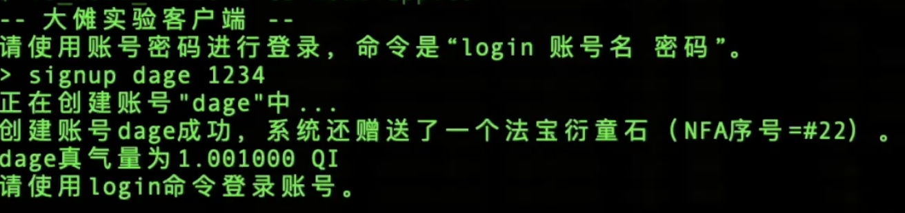
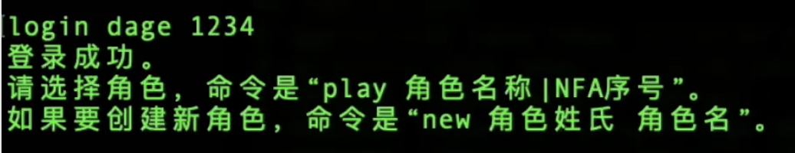
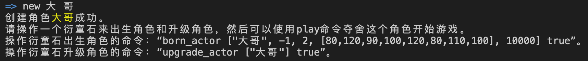
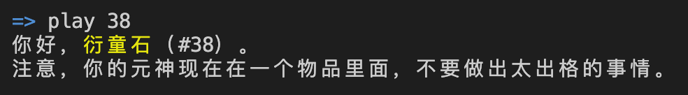
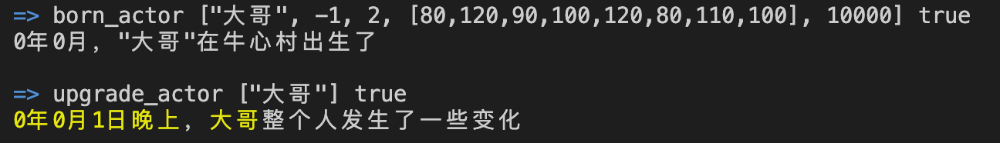
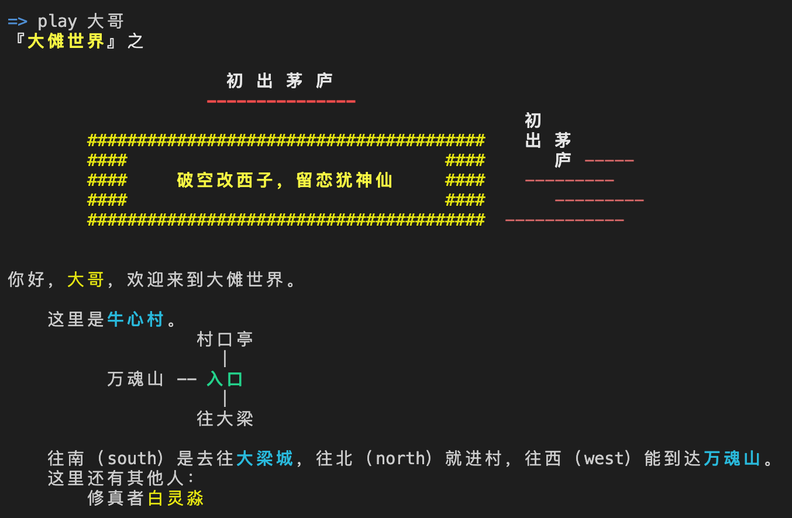
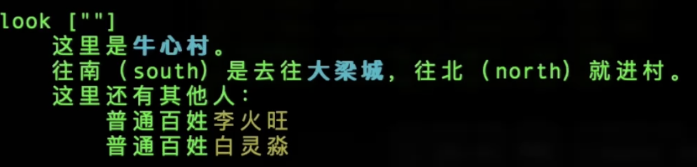
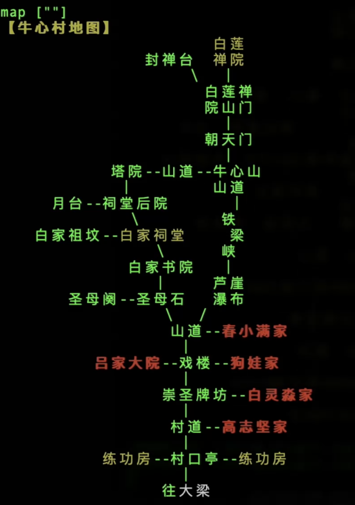
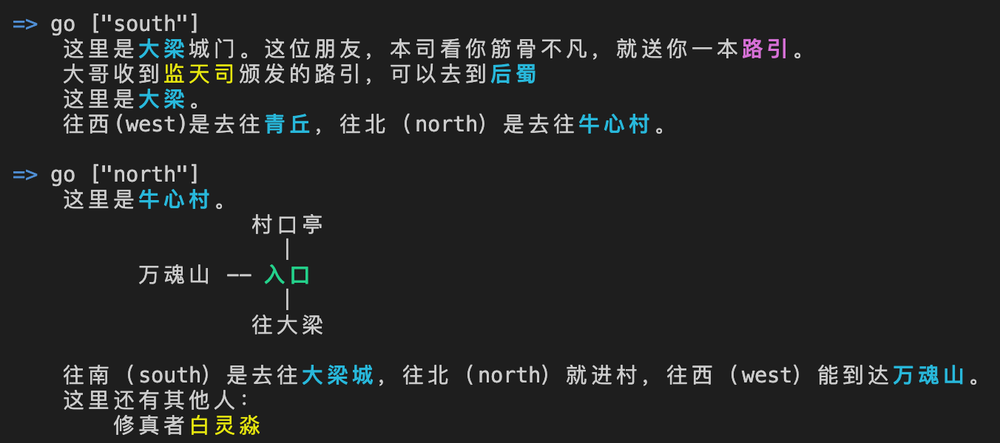

# 使用说明一
-------

以下我们从创建一个新的账号开始来实际截屏，通过截屏来演示这个客户端的使用。

## 启动程序后，我们通过signup命令创建一个新的账号，账号名为`dage`

</a>

<i>创建新账号</i>

- 需要说明的是，为了方便测试，signup命令直接通过账号名和新密码的方式从一个微服务创建新的测试账号。这个账号创建微服务实际上是一个[taiyi-js库的开发示例](https://github.com/hongzhongx/taiyi-js/tree/main/examples/account-server)，可以在taiyi-js的项目代码中看到，它本身是一个利用taiyi-js库开发的很简单nodejs应用。

- 在正式环境中，你的密码只能由你自己保留，可以在本地生成满足太乙网络协议的账号私钥，然后直接连接太乙网络用公钥创建账号，你是不需要把密码或者私钥传输到任何服务器上来完成这个账号创建过程的。有很多开源的工具和方法可以本地来做这件事情，例如太乙网络项目的[xuanpin（玄牝）](https://github.com/hongzhongx/taiyi/tree/main/programs/xuanpin)程序，就是一个基于C++语言编写的连接工具，这个工具有很多直接的命令来和太乙网络的白玉京api交互；另外，taiyi-js库本身也实现了各种密码学的方法以及和白玉京api交互的方法，可以开发基于JS/TS的各种工具和网站，上面说的“测试账号创建微服务”就是一个例子。在未来，可能还有python的库来提供python程序的支持。

- signup这个命令中，微服务拿到你申请的账号名和密码后，直接生成太乙网络格式的私钥和公钥（由于根据账号名和密码按特定规则可以生成相同的私钥，所以微服务不缓存你的任何密码和私钥，以后要使用时就直接生成即可，参考本客户端[代码实现](./app.ts)）。然后，在sifu账号（我们的测试水龙头账号，由他来提供测试的阳寿和真气）的帮助下，自动创建你的账号并绑定你的公钥。同时，sifu账号创建了一个新的“[衍童石](https://github.com/hongzhongx/taiyi-contracts?tab=readme-ov-file#%E8%A1%8D%E7%AB%A5%E7%9F%B3)”法宝并赠送给你，这个法宝后面会被你用来创建角色。接着，sifu账号再传给你一些真气，满足你初期的一些活动，毕竟，体内没有真气运转，不论你是凡人还是修真者，都寸步难行，甚至一个法宝本身的运转，也是需要灌注真气的，这部分理论支持详见[真气守恒定律](https://github.com/hongzhongx/taiyi/blob/main/doc/zhenqishouheng.md)。

## 测试账号创建成功后，就可以使用login命令登录了

</a>

<i>“登录”</i>

- 技术上，这里的“登录”，不是传统网络游戏那种连接上服务器并且握手验证密码成功的意思。这里密码只有你本地才有，这里的登录也仅仅是按规则在本地根据账号密码生成私钥，缓存在本地供后面使用而已，这个过程无需和网络做任何交互。

- 本客户端代码中，这一步在节点服务器上多做了一次“查询”，帮你确保一下你的密码生成的公钥是匹配你这个账号的。

## 创建一个名叫“大哥”的角色

</a>

<i>新建角色“大哥”</i>

- “登录”完成后，就可以凭借太乙网络的协议来和大傩世界交互了。然而从游戏的角度来说，我们这个客户端面对的是“玩家”，因此需要有大傩世界的“角色”来操作。

- new命令来创建角色，第一个参数是姓氏，第二个参数是名讳。角色在太乙网络仅仅是一个实体的概念（NFA），这里创建的新角色默认并没有任何有意思的操作方法和逻辑，甚至都没有出生，因此我们需要一个特殊的系列操作来先把这个角色做成一个“凡人”的样子。

## 扮演一个实体——衍童石

</a>

<i>对于玩传统游戏的玩家来说，这一步很奇怪很特殊。然而，这种操作在太乙网络里面是比较普遍的，也是一种特色。</i>

- 根据[太乙宇宙观](https://github.com/hongzhongx/taiyi/blob/main/doc/yuzhou_explain.md)，账号，对应的就是元神，是没有具体形态的。无论是司命、凡人还是修真者，甚至普通花草树木又或者地点城市和法宝，他们自身虽然含有天道逻辑，但都需要元神来操作。

- 换句话说，账号可以接入到大傩世界的任何角色或者任何实体，能接入的范围之大，从法宝本身，一直到司命。这也是某种意义上的“角色扮演”，一旦账号接入这个“角色”，你就是在扮演它，你可以操作它对应的命令来运转它的天道（SGS脚本）。

- **从这个角度出发，整个大傩世界，并非像传统游戏一样，先开发好代码，再把内容建设好，之后玩家才能来玩，玩家也只是玩一个成品，游戏的内容开发、世界的重大历史进展、人物物品的所有权，都和玩家无关。这里不是，这里从一开始，整个世界只有一些基本的规则（因果规则这些），世界是没有“内容”的，维护因果天道的司命也好，天道逻辑脚本开发人员也好，还是普通的玩家、凡人和修真者，都是从一开始就可以进入这个世界，从一开始就一边通过操作不同实体来建设这个世界，这个世界也在越来越多的天道支撑下进行丰富复杂的运转和演化。所以说，所有接入的账号，既是在玩游戏，也是开发游戏，也是在建设游戏世界。**

## 直接操作“衍童石”来让“大哥”出生并注入人类的天道逻辑

</a>

<i>操作衍童石，稍微参与一下“开发”</i>

- 未来的游戏中，玩家遇到这些原始操作的情况会越来越少，因为世界已经被我们初期进来的接入者建设得很完善了。

- 这里先操作“衍童石”的命令设置“牛心村”为其驻地，然后用它的`born_actor`命令来出生“大哥”这个角色，后面的参数是这个角色的性别性取向什么的，还有各种初始属性值，这个客户端目前很简单，都是直接敲复杂命令，未来的一些客户端特别是图形化客户端，会方便这些操作（甚至可能是自动化的）。

- 最后一个命令是`upgrade_actor`，这个命令是“衍童石”本身的一个特殊功能，就是将指定角色内禀的天道逻辑，升级到我们[实践项目中实验的“凡人”逻辑](https://github.com/hongzhongx/taiyi-contracts/blob/main/nfas/actors/normal.lua)。我们实验的“凡人”，就是一个具有基本的能看（look）、能走（go）、能感受（hp、resource、inventory、map）、能探索（exploit）和能修真（cultivation）的普通人。

- 针对衍童石的这两个命令，都会对世界造成因果影响，因此需要天道司命的确认，命令发出后的响应时间需要等待至少一息（约为三秒钟）。而且，由于要推动因果天道运转，造成因果影响的任何命令，都需要消耗一定的真气。如果你真气不足，则不会成功，这也是测试账号生成服务为啥会给你赠送一些初始真气便于体验的原因了。

## 让我们夺舍“大哥”吧

</a>

<i>开始扮演“大哥”</i>

- 这就比较像MUD游戏了对吧，play命令参数填入角色名称，你就开始以这个角色的视角来进行扮演了。

- 可以看到我们在角色身上使用了一个叫`deposit_qi`命令，这个命令很简单，主要是把元神（账号）中的真气转存一些到“大哥”体内，否则“大哥”生出来体内没有什么真气，做不了什么事情。未来会有像衍童石一样的法宝来专门从事元神和实体之间的交流，这个命令就不会在角色中出现了，这里纯粹是方便快速演示。

## 让我“看一看”

</a>

<i>look</i>

- 根据传统，MUD游戏一般都有look指令的，就是看一下四周，或者看一下某人，或者查看一个事物。

- look命令对太乙世界没有任何影响，用技术的话说，就是只读的，这个操作可以通过任何太乙网络节点完成。你自己甚至可以从太乙网络项目编译[taiyin（太阴）](https://github.com/hongzhongx/taiyi/tree/main/programs/taiyin)程序，本地来启动一个天道节点，然后从这个节点同步大傩世界完成访问。从太乙宇宙世界观来讲，这类操作是不产生因果的，因此不需要通过司命的网络，响应速度就会非常快。由于这类命令不会消耗真气，所以可以重复执行也没有什么问题。

## 看下地图

</a>

<i>map</i>

- 之前操作衍童石的时候，最开始有个set_zone，参数是7，7是测试网络上牛心村的区域NFA序号，因此你这个衍童石就是被设定到了牛心村，从它生出来的人，就都是在牛心村。

## 走一走

</a>

<i>试试走南闯北</i>

- 写这篇说明的时候，测试网络由其他元神创建了“牛心村”和“大梁”两个区域并将它们连通了，虽然这些区域具体没有什么内容，但是可以根据地图往南或者往北走走看。

- 往南走的话，就到达大梁城，触发了大梁城的天道逻辑。作为初期实验，设置了一个发放“路引”（早期实验NFA）的逻辑。注意，未来大梁城的情况随着建设，会变化很大。

- 往北走的话，又回到牛心村，触发的逻辑会给你叙述牛心村的介绍以及当前村里的一些情况，可以看到有两位普通人在，那两个实体是之前北风创建并持续建设的角色。注意，未来牛心村的情况随着建设，会变化很大。