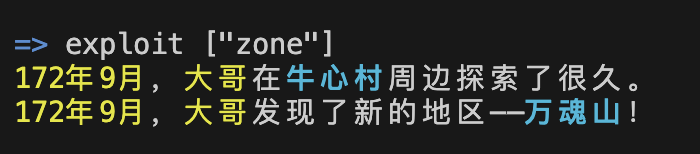
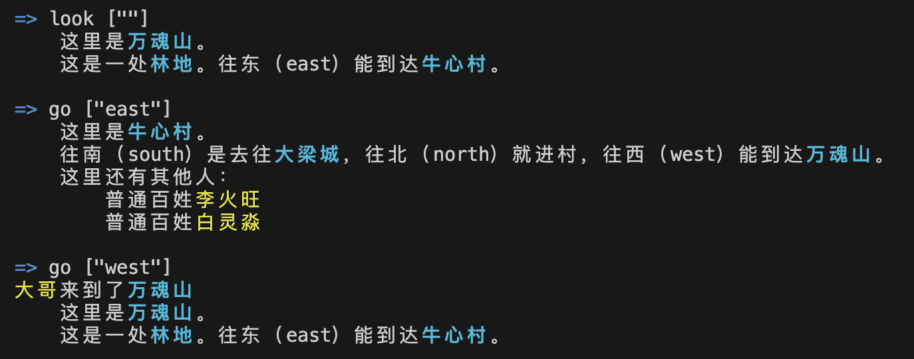
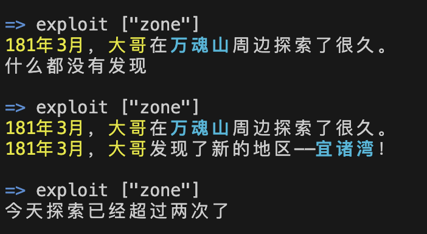

# 使用说明二
-------

以下我们从玩家的视角，从登录一个账号开始来实际截屏，通过截屏来演示这个客户端的使用。

## 启动程序后，我们通过login命令登录账号`dage`

</a>

<i>登录账号</i>

- 在[使用说明一](./illustration1.md)中已经对login命令进行过介绍，这里就不再赘述。

## 开始扮演“大哥”

</a>

<i>选择角色</i>

- 在[使用说明一](./illustration1.md)中已经对play命令进行过介绍，这里就不再赘述。

## 查询装备

</a>

<i>查询</i>

- 命令`look`在不同的环境中，有不同的逻辑，随着大傩世界各个实体建设的进行，未来的look命令也可能涵盖一些查询的能力。

- `inventory`命令一般用来查询装备，参数可以是实体的名称或者序号。既可以查看角色身上有哪些物品，也可以查询一个地区或者一个法宝内含了哪些事物。

- 这些查询命令均是只读的，不会造成因果变化，不会对世界产生影响，所以在操作时候速度较快，可以反复操作，也不会消耗真气。

## 查询状态和属性

</a>

<i>查询自己的状态和属性</i>

- `hp`命令可以快速查询实体的内部状态。可以改变参数来改变查询的类型，例如`-c`参数可以进一步查询实体的属性。

## 查询资源

</a>

<i>查询资源</i>

- `resource`用于查询指定的实体含有什么资源，这些资源是独立可以操作的，例如一个人身上带了多少药材，这种资源可以直接从这个“人”转移给那个“人”。而参数`-m`则是查询这个实体本身材质是由哪些资源构成的，即实体的物质性，相关理论支持参考太乙真气守恒定律中关于[事物的物质量](https://github.com/hongzhongx/taiyi/blob/main/doc/zhenqishouheng.md#%E4%BA%8B%E7%89%A9%E7%9A%84%E7%89%A9%E8%B4%A8%E9%87%8F)一节。

- 例如，图中用`-m`查询牛心村本身是什么质地时，可以看到“食物”这种资源占比最大，这是测试网络在之前的建设中，账号hongzhong在牛心村上放置了实验的法宝“[育田珠](https://github.com/hongzhongx/taiyi-contracts?tab=readme-ov-file#%E8%82%B2%E7%94%B0%E7%8F%A0)”，这个法宝能不断自我运转，目前已经对牛心村这个区域产生了永久性影响，也把这个区域转化成了“农田”类型（区域有各种类型）。

- 由于牛心村质地“食物”占比大，因此五行属性也自动归于属水。

## 探索一下周围

</a>

<i>最原始的采集资源的行为——捡拾</i>

- `exploit`是实验性的一个命令，用来模拟最最原始的采集工作（挖矿？）。根据真气守恒定律，任何物质材料法宝，不会凭空消失，也不会凭空产生，都是经过天道的演化运转从最原始的真气转化而生。而任何实体和这个世界的任何交互，免不了要产生因果，从而不断消耗真气，那么，角色乃至其背后的元神又怎么获得新的真气呢？这里有个最简单也是最原始实际的方式，就是就地捡拾，即探索。写这篇说明的时候，牛心村这样的区域还很荒凉，仅仅是具有了农田的性质，那么原始的探索就应该从农田中拾取到原始的食物来咯。

- 每次探索操作，大哥这个角色都会捡拾到一些食物，对应的，牛心村本身的食物物质也在减少，这个现象可以通过resource查询到。

## 让我们开始“修真”

</a>

<i>修真</i>

- "修真"这个命令能让角色进行一种实验性的修真活动，以此来以另一种形式获得新的真气，具体理论参考太乙真气守恒律中关于[修真](https://github.com/hongzhongx/taiyi/blob/main/doc/zhenqishouheng.md#%E4%BF%AE%E7%9C%9F)的阐述。

- 修真活动这里简化为两个命令，一个是启动修真`start_cultivation`，一个就是结束修真`stop_cultivation`。目前角色身上这个修真天道非常简单，只是把角色自身加入到修真活动中，结束时直接将新修来的真气灌回角色体内即可。未来，修真这种活动可能非常复杂，我们以后再说。

## 探索区域四周，开拓新的疆域

</a>

<i>在牛心村周围发现了新区域</i>

- `exploit`这个命令，如果带上一个参数"zone"，则表示要在当前所在的区域四周深度探索一下，可能就会发现新的地区。这是大哥在经过了多次exploit ["zone"]后，在牛心村旁边发现了一个新的地区，名为“万魂山”。

- 探索出来的新区域，自动和探索者所在地建立双向连接，名称和类型由太乙网络的底层天道合约自动生成，下图可以看到，万魂山是片林地。
- 注意，在[建设实践一](https://github.com/hongzhongx/taiyi-contracts?tab=readme-ov-file#%E5%AE%9E%E8%B7%B5%E4%B8%80%E4%BB%8E%E5%88%9B%E5%BB%BA%E8%B4%A6%E5%8F%B7%E5%88%B0%E5%BB%BA%E7%AB%8B%E5%8E%9F%E5%A7%8B%E7%9A%84%E5%8C%BA%E5%9F%9F)中，红中和师傅两个元神，用最原始的天道，通过法宝“接界符”才能完成两个区域的连接。而现在在游戏中，玩家角色一旦发现新区域，连接就自动完成了。

</a>

<i>建设新地区——万魂山</i>

- 谁开拓出来的新区域，所有者就是谁，因此目前“万魂山”的所有权就是归元神账号dage所有。
- 目前测试网络上，“牛心村”的所有者是hongzhong。为了建设新开拓出来的区域，hongzhong需要改造牛心村的道路，就要使用“太虚符”来升级牛心村的天道代码。上图可以看到，牛心村出口已经增加了一个往西的方向（west）来通向新区域“万魂山”。
- 同样的，dage使用“太虚符”升级了万魂山的天道代码。图中可以看到，万魂山往东方向，已经能到达牛心村了。大哥试着在牛心村和万寿山之间走一走，就可以看到相应的变化。
- 可以看到，hongzhong和dage是完全匿名的两个元神账号，其中之一在天道规则下探索出新的地图来，另外一位如果愿意让自己的地盘和新区域合作发展，那么就协作着升级区域，谱写新的故事。当然如果以后万魂山作恶，hongzhong大可以让牛心村断开通道，保得一方平安。

</a>

<i>继续开拓新疆域</i>

- 探索新区域的命令会消耗角色不少真气，而且角色一天最多只能做两次这种工作。好在测试网络上设置的现实时间十分钟就相当于大傩世界一个月，很快，大哥在万寿山周围就又探明一处叫“宜诸湾”的区域，看名字类型应该是海洋了。
- 那么问题来了，升级新区域的这些“太虚符”哪里有？师傅（sifu）账号笑了笑~~

……测试网络持续运行中，待续
