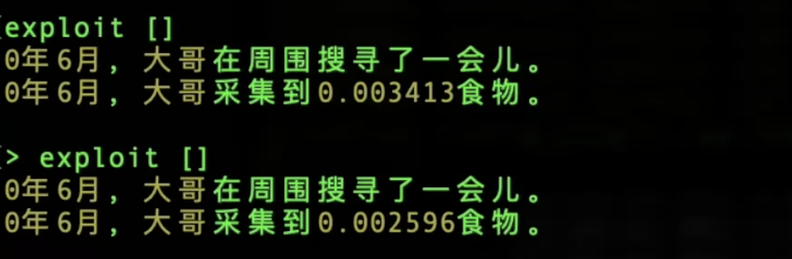

# 使用说明二
-------

以下我们从玩家的视角，从登录一个账号开始来实际截屏，通过截屏来演示这个客户端的使用。

## 启动程序后，我们通过login命令登录账号`dage`

</a>

<i>登录账号</i>

- 在[使用说明一](./illustration1.md)中已经对login命令进行过介绍，这里就不再赘述。

## 开始扮演“大哥”

</a>

<i>选择角色</i>

- 在[使用说明一](./illustration1.md)中已经对play命令进行过介绍，这里就不再赘述。

## 查询装备

</a>

<i>查询</i>

- 命令`look`在不同的环境中，有不同的逻辑，随着大傩世界各个实体建设的进行，未来的look命令也可能涵盖一些查询的能力。

- `inventory`命令一般用来查询装备，参数可以是实体的名称或者序号。既可以查看角色身上有哪些物品，也可以查询一个地区或者一个法宝内含了哪些事物。

- 这些查询命令均是只读的，不会造成因果变化，不会对世界产生影响，所以在操作时候速度较快，可以反复操作，也不会消耗真气。

## 查询状态和属性

</a>

<i>查询自己的状态和属性</i>

- `hp`命令可以快速查询实体的内部状态。可以改变参数来改变查询的类型，例如`-c`参数可以进一步查询实体的属性。

## 查询资源

</a>

<i>查询资源</i>

- `resource`用于查询指定的实体含有什么资源，这些资源是独立可以操作的，例如一个人身上带了多少药材，这种资源可以直接从这个“人”转移给那个“人”。而参数`-m`则是查询这个实体本身材质是由哪些资源构成的，即实体的物质性，相关理论支持参考太乙真气守恒定律中关于[事物的物质量](https://github.com/hongzhongx/taiyi/blob/main/doc/zhenqishouheng.md#%E4%BA%8B%E7%89%A9%E7%9A%84%E7%89%A9%E8%B4%A8%E9%87%8F)一节。

- 例如，图中用`-m`查询牛心村本身是什么质地时，可以看到“食物”这种资源占比最大，这是测试网络在之前的建设中，账号hongzhong在牛心村上放置了实验的法宝“[育田珠](https://github.com/hongzhongx/taiyi-contracts?tab=readme-ov-file#%E8%82%B2%E7%94%B0%E7%8F%A0)”，这个法宝能不断自我运转，目前已经对牛心村这个区域产生了永久性影响，也把这个区域转化成了“农田”类型（区域有各种类型）。

- 由于牛心村质地“食物”占比大，因此五行属性也自动归于属水。

## 探索一下周围

</a>

<i>最原始的采集资源的行为——捡拾</i>

- `exploit`是实验性的一个命令，用来模拟最最原始的采集工作（挖矿？）。根据真气守恒定律，任何物质材料法宝，不会凭空消失，也不会凭空产生，都是经过天道的演化运转从最原始的真气转化而生。而任何实体和这个世界的任何交互，免不了要产生因果，从而不断消耗真气，那么，角色乃至其背后的元神又怎么获得新的真气呢？这里有个最简单也是最原始实际的方式，就是就地捡拾，即探索。写这篇说明的时候，牛心村这样的区域还很荒凉，仅仅是具有了农田的性质，那么原始的探索就应该从农田中拾取到原始的食物来咯。

- 每次探索操作，大哥这个角色都会捡拾到一些食物，对应的，牛心村本身的食物物质也在减少，这个现象可以通过resource查询到。

## 让我们开始“修真”

</a>

<i>修真</i>

- "修真"这个命令能让角色进行一种实验性的修真活动，以此来以另一种形式获得新的真气，具体理论参考太乙真气守恒律中关于[修真](https://github.com/hongzhongx/taiyi/blob/main/doc/zhenqishouheng.md#%E4%BF%AE%E7%9C%9F)的阐述。

- 修真活动这里简化为两个命令，一个是启动修真`start_cultivation`，一个就是结束修真`stop_cultivation`。目前角色身上这个修真天道非常简单，只是把角色自身加入到修真活动中，结束时直接将新修来的真气灌回角色体内即可。未来，修真这种活动可能非常复杂，我们以后再说。